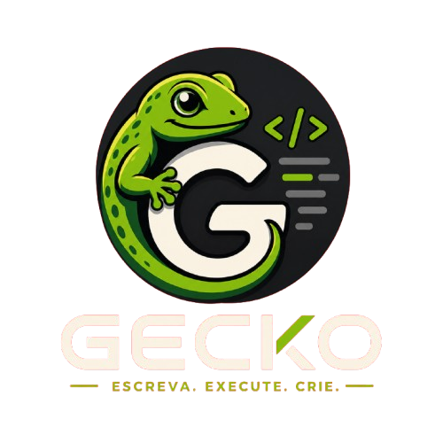

<div align="center">
  


</div>

**Gecko** — linguagem de script moderna com dois backends de execução: interpretador tree-walking AST e máquina virtual bytecode stack-based. Escrito em C++20, com módulos nativos para JSON, HTTP, File I/O e async/await.

## Recursos

- **Dois backends**: `--backend=tree` (padrão, debug) e `--backend=vm` (bytecode compilado, performance)
- **Sistema de módulos**: `import`, `export`, `package` com resolução de dependências e cache
- **Orientação a objetos**: classes, métodos, `this`, herança simples
- **Estruturas de controle**: `if`/`else`, `while`, `for`, `break`, `try`/`catch`
- **Módulos nativos**: `json` (parse/stringify/read/write), `http` (cliente + servidor Express-like), `fs` (file I/O)
- **Async/Await**: suporte nativo a funções assíncronas
- **Stack trace**: erros de runtime com trace no estilo Node.js
- **Segurança**: sandbox de módulos, hardening de HTTP, sanitizers (ASan/UBSan/TSan) em CI

## Links

- [Documentação](docs/overview.md)
- [Guia de início rápido](docs/getting-started.md)
- [Arquitetura](docs/architecture.md)
- [Especificação da linguagem](docs/language-spec.md)
- [Tratamento de erros](docs/error-handling.md)
- [Contribuição](docs/contributing.md)

## Estrutura

```
src/
├── cli/main.cpp           — entrypoint, CLI flags
├── lexer/                 — tokenização
├── parser/                — AST recursivo descendente
├── ast/Nodes.h            — definições da AST (Visitor Pattern)
├── interpreter/           — tree-walking interpreter (backend tree)
│   ├── environment/       — escopos
│   ├── module/            — ModuleLoader, HttpModule, JsonModule
│   └── runtime/           — UserFunction, UserClass, ReturnException
├── compiler/              — compilador AST → bytecode (backend vm)
├── vm/                    — stack-based VM (Chunk, Value, Object, Disassembler)
└── utils/Logger.cpp       — logging e stack trace
```

## Instalação

### Termux (Android)
```bash
chmod +x scripts/install-in-termux.sh
./scripts/install-in-termux.sh
```

### Compilação manual
```bash
cmake -B build -S .
cmake --build build
./build/gecko examples/00_hello.gk
```

### Executar com VM bytecode
```bash
./build/gecko --backend=vm examples/00_hello.gk
```

## Segurança

- **Sandbox de módulos**: importações validadas contra a raiz do projeto e diretórios permitidos
- **Hardening de HTTP**: sanitização de cabeçalhos em chamadas HTTP
- **CI**: CodeQL + ASan/UBSan/TSan em todos os pipelines

## Exemplo

```go
package main;

import http from "http";
import json from "json";

var app = http.createServer();

app.get("/api/hello", func(req, res) {
    res.json({ message: "Hello from Gecko!" });
});

app.listen(3000);
```
